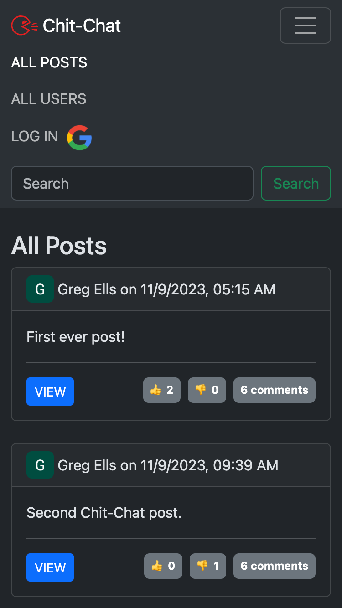
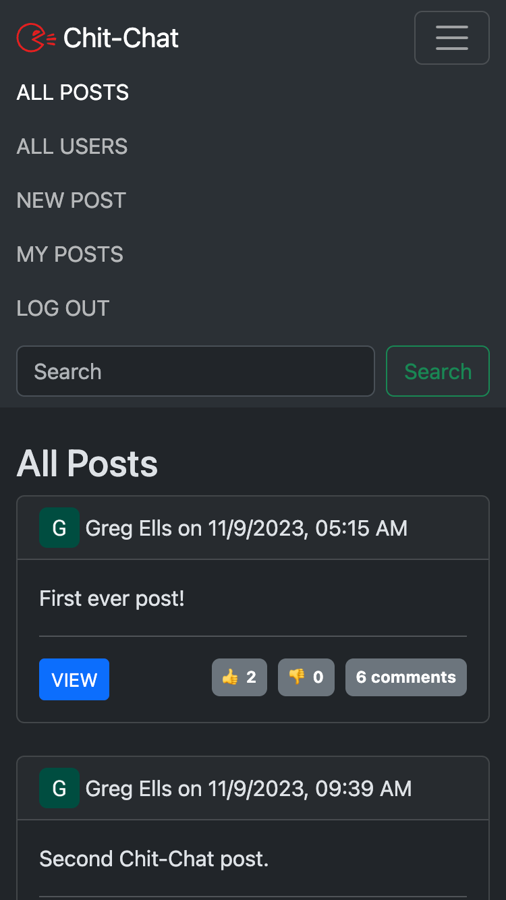
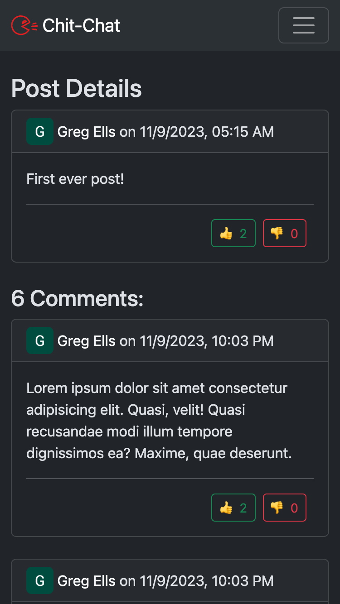
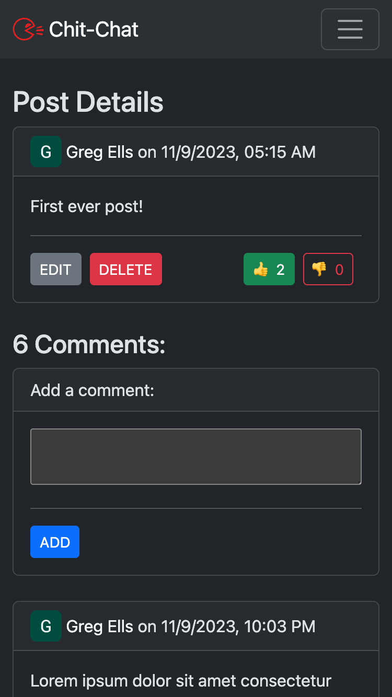
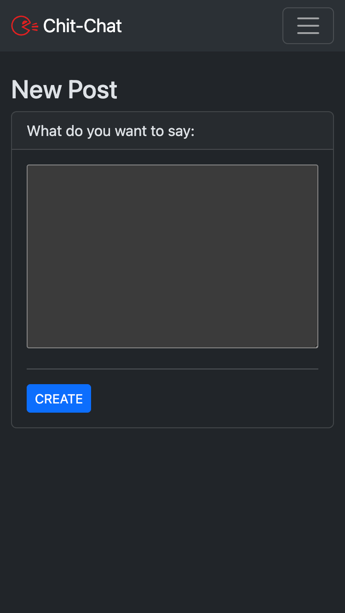
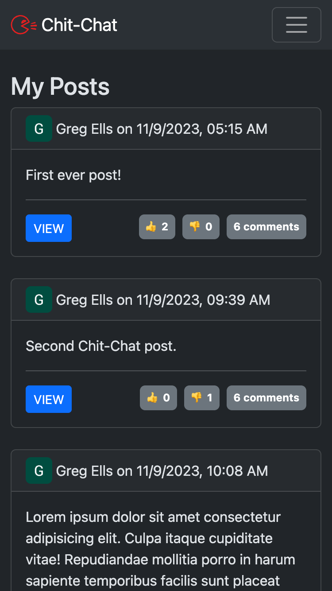
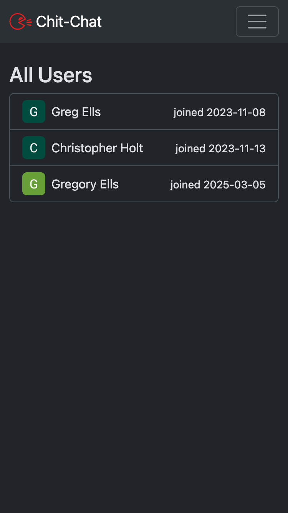
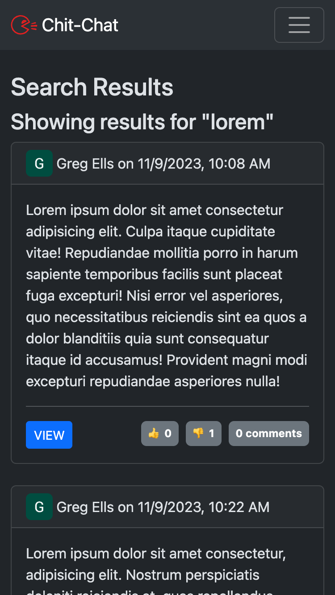

# Chit-Chat
This project is a Twitter-like app where users can make posts, comment on posts, and thumbs-up/thumbs-down posts and comments.

Visitors to the site may browse posts and comments without signing in.

To create, edit, delete, or vote on posts and comments, users must sign-in using a Google account.

[View the live website here.](https://chit-chat-5142bec3ce1d.herokuapp.com/)

## Screenshots:
|  |  |  |
|:---:|:---:|:---:|
| Home Page | Navbar - Visitors | Navbar - Users |

|  |  |  |
|:---:|:---:|:---:|
| Post - Visitors | Post - Users | New Post |

|  |  |  |
|:---:|:---:|:---:|
| My Posts | All Users | Search |

## Technologies Used:
* Node.js: the app is built using a Node.js server.
* Express: the server uses the Express framework.
* MongoDB: data is persisted to a MongoDB database.
* Mongoose: the database is interacted with using the Mongoose library.
* OAuth: authentication is provided by Google's OAuth API via the Passport library.
* CSS: the styling is achieved using the Bootstrap CSS framework.
* Heroku: the live website is hosted on Heroku.
* Atlas: the database is hosted on MongoDB's Atlas service.

## Getting Started:

## Future Development:
* Expand search functionality to include comments and user names.
* Ability to sort posts by thumbs-up, thumbs-down, newer, older.
* See edit history of posts & comments.

## Known Bugs:
No known bugs at this time.